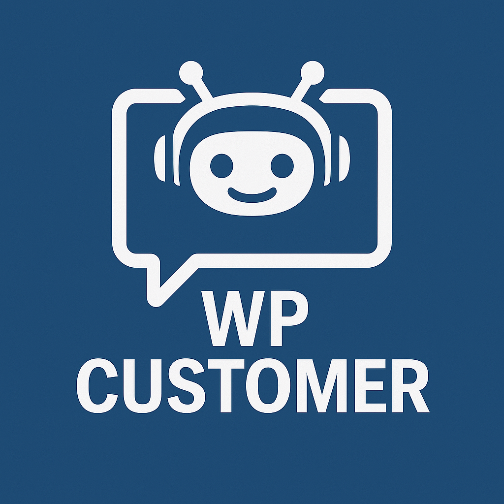

# AI Agent For WordPress Customer assistance &middot; 
<table>
  <tr>
    <td>
      
    </td>
    <td>
      <strong>AI agent designed to provide WordPress customer assistance</strong>
    </td>
  </tr>
</table>

## Configuration

After installing the Agent through the OpenKBS WordPress plugin, follow these steps to configure the key features:
 
### Search Widget Setup

1. Navigate to **OpenKBS → Settings → Applications → WP Customer**
2. Enable "Semantic Search Indexing"
3. Click "Start Indexing" to generate embeddings for your existing WordPress content (posts, pages, products)
4. Go to **OpenKBS → Settings → Public Search API**
5. Enable "Public Search API"
6. Copy the provided Shortcode
7. Navigate to **Appearance → Widgets**
8. Add a "Shortcode" widget to your header widget area

> **Note**: If you have "WP Agent" installed, you can ask it to integrate the Shortcode into your wordpress or replace the woocommerce default search

 

### Chat Widget Setup

The chat widget integrates automatically with the site search, enabling the LLM AI Model to search your website data and assist clients with real-world actions.

To enable the Chat Widget:

1. Go to **OpenKBS → Settings → Applications → WP Customer**
2. Enable the "Website Chat Widget"

