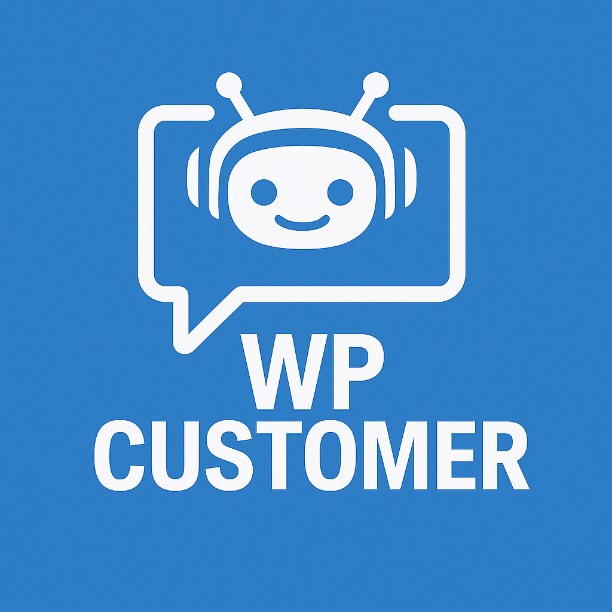

# AI Agent For WordPress Customer assistance &middot; 
<table>
  <tr>
    <td>
      
    </td>
    <td>
      <strong>AI agent designed to provide WordPress customer assistance</strong>
    </td>
  </tr>
</table>

## Configuration

After installing the Agent through the OpenKBS WordPress plugin, follow these steps to configure the key features:

#### Setup Semantic Search:
Semantic Search creates and maintains embeddings of your WordPress content, enabling AI-powered search capabilities across your site.

1. Navigate to **OpenKBS → Settings → Applications → WP Customer**
2. Enable "Semantic Search Indexing"
3. Click "Start Indexing" to generate embeddings for your existing WordPress content

#### Chat Widget Setup:

The chat widget integrates automatically and **requires Semantic Search**, enabling the LLM AI Model to search your website data and assist clients with real-world actions.

1. Go to **OpenKBS → Settings → Applications → WP Customer**
2. Enable the "Website Chat Widget"

#### Public Search Widget (optional):
Enables a public search endpoint allowing website visitors to perform semantic searches through a widget interface.

1. Go to **OpenKBS → Settings → Public Search API**
2. Enable "Public Search API"
3. Copy the provided Shortcode
4. Navigate to **Appearance → Widgets**
5. Add a "Shortcode" widget to your WordPress header widget area